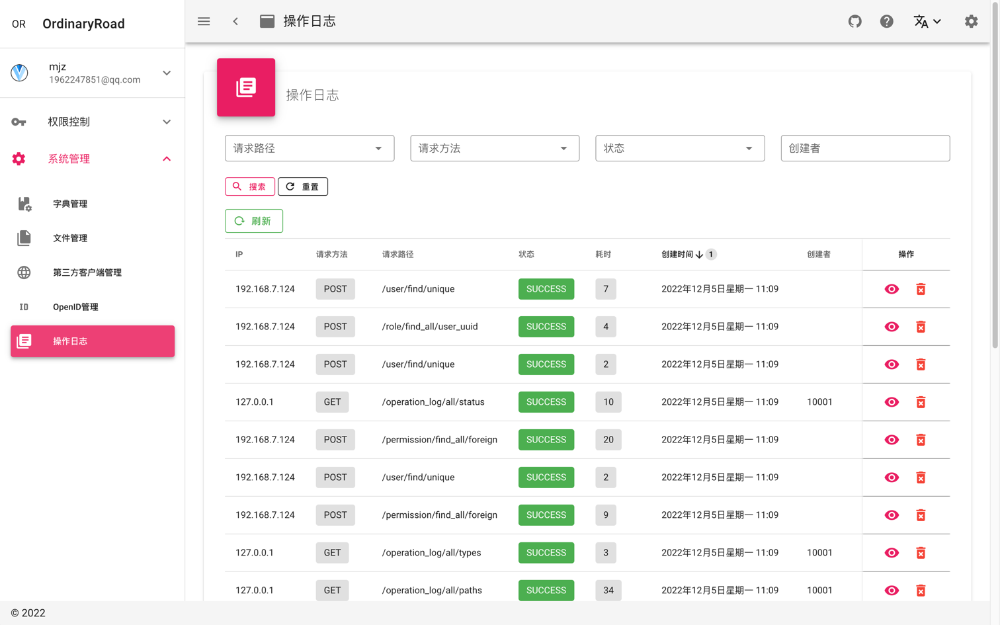
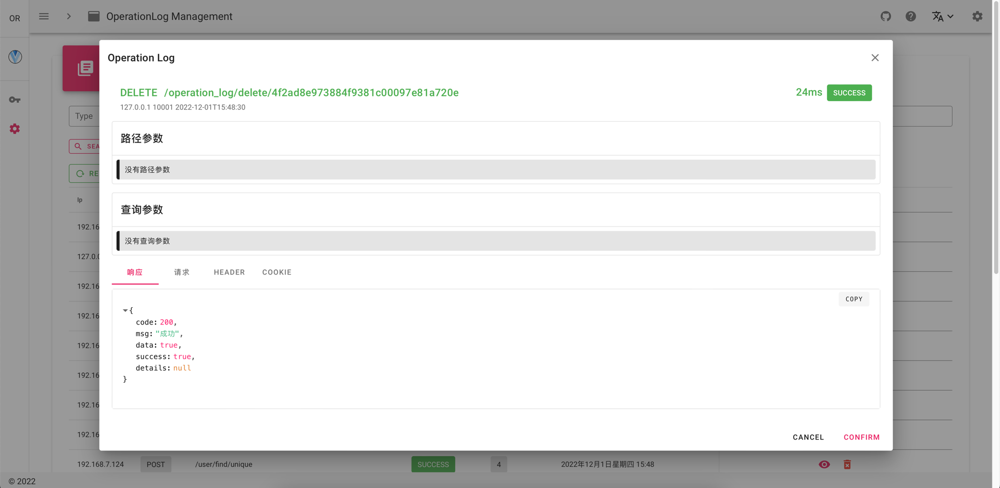
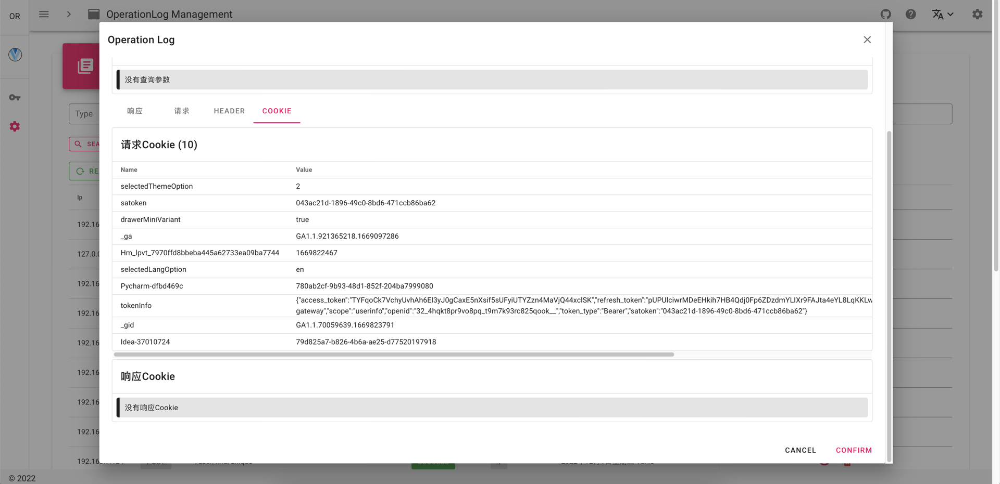

# 日志模块

[//]: # (TODO 更新图片)







## 功能

- 打印DEBUG级别操作日志
- 操作日志入库
- 仿Safari操作日志查询界面

## 实现方式

1. 拦截器封装Request和Response，使支持多次读取body
2. 过滤器记录请求和响应，并入库

### 过滤器

```java

@Configuration
@WebFilter(filterName = "WrapHttpServletFilter", urlPatterns = "/**")
@Order(10000)
public class WrapHttpServletFilter implements Filter {

    @Override
    public void doFilter(ServletRequest servletRequest, ServletResponse servletResponse, FilterChain filterChain) throws ServletException, IOException {
        ServletRequest requestWrapper = servletRequest;
        if (servletRequest instanceof HttpServletRequest) {
            requestWrapper = new RequestWrapper(Thread.currentThread().getId(), (HttpServletRequest) servletRequest);
        }
        ServletResponse responseWrapper = servletResponse;
        if (servletResponse instanceof HttpServletResponse) {
            responseWrapper = new ResponseWrapper(Thread.currentThread().getId(), (HttpServletResponse) servletResponse);
        }
        filterChain.doFilter(requestWrapper, responseWrapper);
    }

}
```

### 拦截器

```java

@Slf4j
@Configuration
@ConditionalOnExpression("${ordinaryroad.commons.log.interceptor.enabled:true}")
public class OperationLogInterceptor implements HandlerInterceptor {

    private static final int MAX_BODY_LENGTH = 10000000;
    private final ThreadLocal<Long> TL_START_TIME = new ThreadLocal<>();
    private final ThreadLocal<OperationLogDO> TL_OPERATION_LOG = new ThreadLocal<>();

    @Autowired
    private OperationLogService operationLogService;

    @Autowired
    private IOperationLogInterceptorService operationLogInterceptorService;

    @Override
    public boolean preHandle(HttpServletRequest request, HttpServletResponse response, Object handler) {
        if (log.isDebugEnabled()) {
            log.debug("==========request start==========");
        }
        TL_START_TIME.set(System.currentTimeMillis());
        Object loginIdDefaultNull = StpUtil.getLoginIdDefaultNull();
        OperationLogDO operationLogDO = new OperationLogDO();
        TL_OPERATION_LOG.set(operationLogDO);

        operationLogDO.setIp(ServletUtil.getClientIP(request));
        operationLogDO.setPath(request.getRequestURI());
        operationLogDO.setMethod(request.getMethod());
        operationLogDO.setHeaders(JSON.toJSONString(ServletUtils.getHeaderMap(request)));
        operationLogDO.setCookies(JSON.toJSONString(ServletUtils.readCookieMap(request)));
        operationLogDO.setQueryParams(JSON.toJSONString(ServletUtils.getQueryParamsMap(request)));

        if (!PathConstants.UPMS_FILE_UPLOAD.equals(operationLogDO.getPath())) {
            // 长度最大一百万
            operationLogDO.setRequest(StrUtil.subWithLength(new String(((RequestWrapper) request).toByteArray(), StandardCharsets.UTF_8), 0, MAX_BODY_LENGTH));
        }

        if (log.isDebugEnabled()) {
            log.debug("current userId: {}", loginIdDefaultNull);
            log.debug("ip: {}", operationLogDO.getIp());
            log.debug("path: {}", operationLogDO.getPath());
            log.debug("method: {}", operationLogDO.getMethod());
            log.debug("headers: {}", operationLogDO.getHeaders());
            log.debug("cookies: {}", operationLogDO.getCookies());
            // log.debug("path params: {}", operationLogDO.getPathParams());
            log.debug("query params: {}", operationLogDO.getQueryParams());
            log.debug("request body: {}", operationLogDO.getRequest());
        }

        return Boolean.TRUE;
    }

    @Override
    public void postHandle(HttpServletRequest request, HttpServletResponse response, Object handler, ModelAndView modelAndView) {
    }

    @Override
    public void afterCompletion(HttpServletRequest request, HttpServletResponse response, Object handler, Exception ex) {
        OperationLogDO operationLogDO = TL_OPERATION_LOG.get();

        operationLogDO.setType(operationLogInterceptorService.getType((RequestWrapper) request, (ResponseWrapper) response, null));
        HttpStatus httpStatus = HttpStatus.resolve(response.getStatus());
        Optional.ofNullable(httpStatus).ifPresent(t -> operationLogDO.setStatus(t.name()));

        operationLogDO.setResponseHeaders(JSON.toJSONString(ServletUtils.getHeaderMap(response)));

        if (!PathConstants.UPMS_FILE_DOWNLOAD.equals(operationLogDO.getPath())) {
            String responseString = new String(((ResponseWrapper) response).toByteArray(), StandardCharsets.UTF_8);
            if (StrUtil.isNotBlank(responseString)) {
                Result<?> result = JSON.parseObject(responseString, Result.class);
                Optional.ofNullable(operationLogInterceptorService.getType((RequestWrapper) request, (ResponseWrapper) response, result)).ifPresent(operationLogDO::setType);
                Optional.ofNullable(operationLogInterceptorService.getStatus((RequestWrapper) request, (ResponseWrapper) response, result)).ifPresent(operationLogDO::setStatus);
            }
            // 长度最大一百万
            operationLogDO.setResponse(StrUtil.subWithLength(responseString, 0, MAX_BODY_LENGTH));
        }

        long consumedTime = System.currentTimeMillis() - TL_START_TIME.get();
        operationLogDO.setConsumedTime(consumedTime);

        if (operationLogDO.getType() != null) {
            // save
            operationLogService.create(operationLogDO);
        } else {
            if (!HttpMethod.GET.matches(operationLogDO.getMethod())) {
                log.warn("OperationLog type is null when not GET");
            } else {
                if (log.isDebugEnabled()) {
                    log.debug("skip GET method when type is null");
                }
            }
        }

        TL_OPERATION_LOG.remove();
        TL_START_TIME.remove();

        if (log.isDebugEnabled()) {
            log.debug("response status: {}", operationLogDO.getStatus());
            log.debug("response headers: {}", operationLogDO.getResponseHeaders());
            // log.debug("response cookies: {}", operationLogDO.getResponseCookies());
            log.debug("response body: {}", operationLogDO.getResponse());
            log.debug("consumed time: {}", operationLogDO.getConsumedTime());
            log.debug("==========request end==========");
        }
    }

}
```
